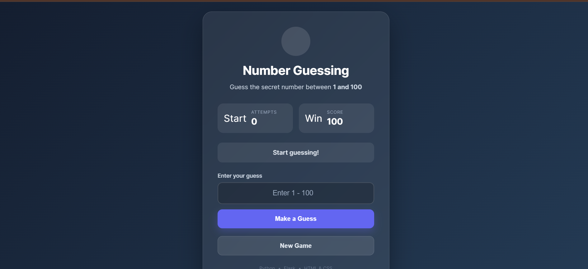
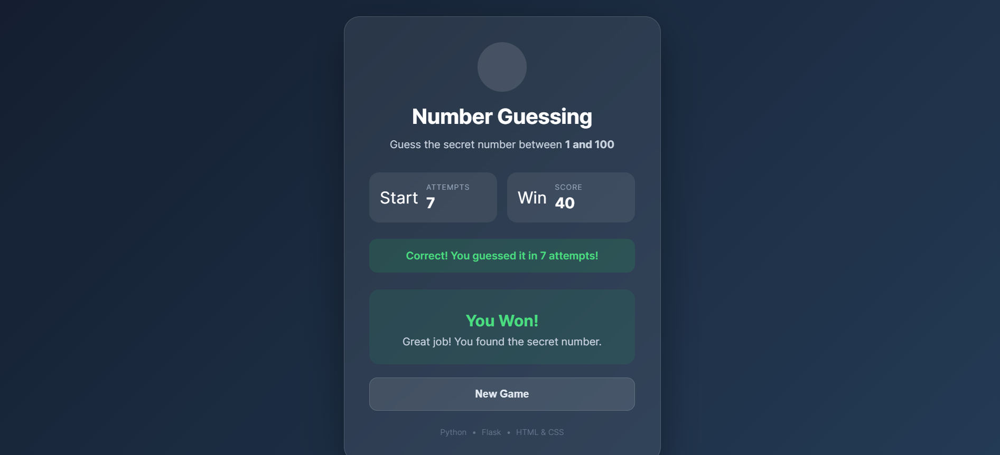

# Number Guessing Game

A simple web-based Number Guessing Game built with **Python and Flask**.

The idea is simple: the computer chooses a random number between **1 and 100**, and the user keeps guessing until the correct number is found. After every wrong guess, the game tells you whether your guess is **too high or too low**.

I built this project to practice Python logic and learn how to connect a Python/Flask backend with a simple HTML and CSS frontend.

> **No JavaScript is used in this project.**

## Live Demo

**[Play the Game](https://number-guessing-game-91zf.onrender.com/)**

Replace the link above with your deployed Render URL.

## Screenshots

### Start Game



### Winning Screen



## Features

- Random number generation from 1 to 100
- User can enter a guess through the web interface
- Shows a hint when the guess is too high
- Shows a hint when the guess is too low
- Score starts at 100
- 10 points are deducted for each wrong guess
- Tracks the number of attempts
- Shows a winning message after the correct guess
- New Game option
- Uses Flask sessions to keep each user's game state separate
- Responsive UI for desktop and mobile
  

## 🛠️ Technologies Used

- **Python**
- **Flask**
- **HTML5**
- **CSS3**
- **Jinja2 Templates**

## Project Structure

```text
number-guessing-game/
│
├── app.py
├── requirements.txt
├── .gitignore
│
├── templates/
│   └── index.html
│
└── static/
    └── style.css
```

## Run the Project Locally

### 1. Clone the repository

```bash
git clone YOUR-GITHUB-REPOSITORY-LINK
```

### 2. Open the project

```bash
cd number-guessing-game
```

### 3. Install the required packages

```bash
pip install -r requirements.txt
```

### 4. Run the Flask application

```bash
python app.py
```

### 5. Open it in your browser

```text
http://127.0.0.1:5000
```

## How the Game Works

1. A random number between **1 and 100** is generated.
2. The user enters a guess.
3. Flask checks the guess against the secret number.
4. If the guess is higher, the user gets a **Too High** hint.
5. If the guess is lower, the user gets a **Too Low** hint.
6. Every wrong guess reduces the score by **10 points**.
7. When the correct number is guessed, the game ends and the final score is shown.
8. The **New Game** button starts a fresh game with a new random number.

##  Scoring

| Result | Score |
|---|---:|
| Starting score | 100 |
| Wrong guess | -10 |
| Correct guess | Game won |

## What I Learned

While building this project, I practiced:

- Python conditional statements
- Loops and random number generation
- Flask routes
- GET and POST requests
- HTML forms
- Jinja2 template variables and conditions
- Flask sessions
- Connecting frontend forms with Python backend
- Basic responsive CSS
- Deploying a Flask application

## Deployment

This project can be deployed using platforms such as **Render**.

For a production deployment, the application can be started with:

```bash
gunicorn app:app
```

##  Author

**Ranjit Gupta**

Built as a Python + Flask learning project.
